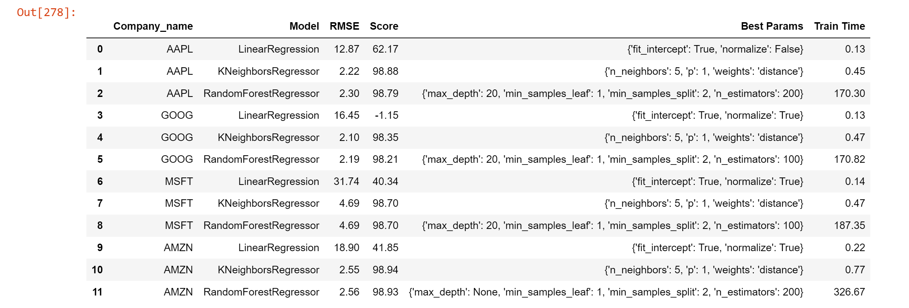
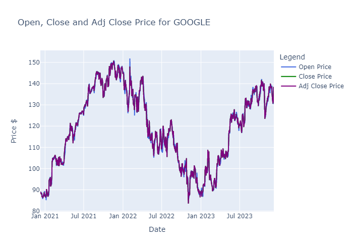
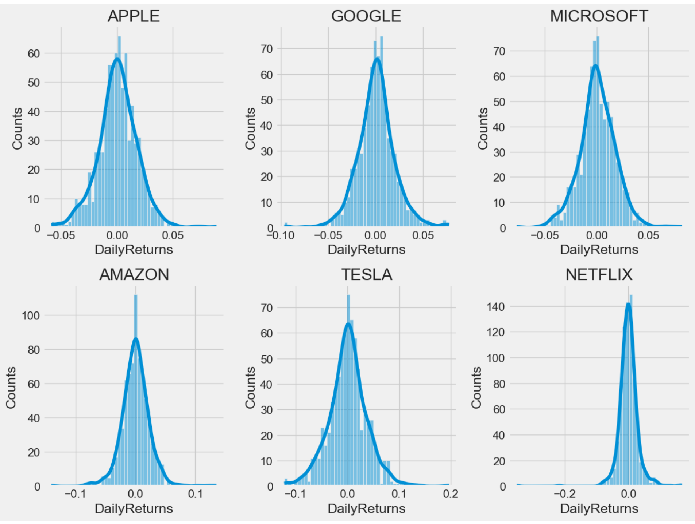

# stock-price-prediction

## Executive summary

## Project overview and goals:

Here will be exploring data from the stock market, particularly some technology stocks (Apple, Amazon, Google, and Microsoft,Tesla and Netflix), data will be sourced from yfinance, will be performing data preprocessing, visualizing different aspects using Matplotlib, Seaborn and Plotly.

The goal of stock prediction model is to leverage machine learning algorithms to analyze history of the stocks, identify patterns, and generate predictions about future stock prices through different modeling strategies.

## Data Source :
Data is sourced from Yahoo Finance using the yfinance apis.

## Expected Result :
The expected results include the development of a predictive model with the capability to forecast stock price movements. The primary goal is to provide investors and traders with valuable insights into future price trends, allowing them to make well-informed investment decisions. By accurately predicting stock price movements, this model aims to enhance investment strategies, mitigate risk, and potentially maximize financial returns.

## Findings :
This stock price prediction analysis employed a diverse set of modeling techniques to forecast future stock prices. Multiple models, including Linear Regression, KNeighbors Regressor,Random Forest, ARIMA, LSTM, among others, were utilized to capture different aspects of the stock market dynamics.

The performance of these models was assessed using various evaluation metrics such as Root Mean Squared Error (RMSE), R-squared (R2) score, and Mean Absolute Error (MAE). Each model was trained on historical stock price data and evaluated on a test dataset to measure its predictive capabilities.

Overall, each model showcased unique strengths and varying performance levels, with some surpassing others in accuracy and reliability. Models like KNeighbors and Random Forest exhibited robustness and predictive power, yielding lower RMSE and higher R2 scores compared to simpler model like Linear Regression. The ARIMA model exhibited competitive performance, while LSTM demonstrated potential in capturing long-term dependencies but required further optimization.

## Results and Conclusion :

**Regression Models (Linear Regression, KNeighbors Regressor, Random Forest)**
The KNeighbors Regressor and Random Forest Regressor exhibited better performance compared to Linear Regression, achieving accuracies exceeding 98% and demonstrating reduced RMSE values, results were observed with following specified hyperparameters.

**Time Series (ARIMA)**

The ARIMA model was evaluated on a test dataset using various evaluation metrics:

   - **RMSE (Root Mean Squared Error):** The ARIMA model achieved an RMSE of 2.13, indicating the average difference between predicted and actual values.  
   - **MAE (Mean Absolute Error):** With an MAE of 1.57, the ARIMA model showcased the absolute average difference between forecasted and observed values.

   

   **Visualization**

    The model's predictions were visualized against the actual values:

    

  **Parameter Performance**

    Parameters (p, d, q) used in the ARIMA model:
    - p (AR parameter): 4
    - d (Differencing): 2
    - q (MA parameter): 4

    The model's performance was notably affected by the chosen parameters. Adjusting these values might improve future predictions.

**LSTM**

The LSTM model was evaluated using following key performance metrics:

  **RMSE (Root Mean Squared Error):** The LSTM model achieved an RMSE of 176.59, signifying the average difference between predicted and actual stock prices.
  **MAE (Mean Absolute Error):** With an MAE of 176.44, the model showcased the absolute average difference between forecasted and observed stock prices.

  

  **Forecast Visualization**

  The model's predictions were visualized against the actual stock prices:

  

  
**Conclusion**   
In this case study, built various predictive models, including linear regression, KNeighbors Regressor, Random Forest, ARIMA, and LSTM to forecast stock prices. Each model offered distinct strengths and demonstrated varying degrees of performance in capturing the complexities of stock market dynamics.

   **Model Performance :**
    **Linear Regression:** Provided a simple baseline but lacked the complexity to capture intricate market behaviors, resulting in limited accuracy.
    **KNeighbors Regressor:** model demonstrated strong predictive capabilities with high accuracy and reliability and lower RMSE showcasing its efficacy in handling complex patterns within the dataset.
    **Random Forest:** Showcased robustness in handling nonlinear relationships, achieving higher accuracy and lower RMSE, especially in medium-term predictions.
    **ARIMA:** Exhibited competitive performance, particularly in capturing short-term trends, with a lower RMSE compared to simpler models.
    **LSTM:** Demonstrated potential in capturing long-term dependencies but required further optimization to enhance its generalization and reduce prediction errors.

## Future Directions:

* Experiment with Advanced Techniques: Incorporate advanced deep learning architectures or ensemble methods to harness the strengths of various models.
* Incorporate External Factors: Integrate external factors (e.g., economic indicators, news sentiment) for a more comprehensive predictive model.
* Continuous Evaluation: Regularly assess and update models to adapt to evolving market dynamics.

### Next steps and recommendations
**Hyperparameter Optimization:** Conduct thorough hyperparameter tuning for existing models (e.g. ARIMA, LSTM) to further enhance predictive performance.
**Ensemble Methods:** Explore ensemble techniques like stacking or blending to combine predictions from multiple models for improved accuracy.
**Additional Features:** Consider incorporating external data sources or derived features to capture more relevant information.
**Sequence Length Optimization:** Experiment with different sequence lengths in LSTM or other time-aware models to capture temporal dependencies more effectively.
**Incorporate External Indicators:** Integrate economic indicators, news sentiment, or social media data to improve the model's predictive power.
**Model Updates:** Regularly retrain and update models using the latest data to adapt to evolving market dynamics.

**Data Source**
We will be sourcing data from Yahoo Finance using yfinance library which offers easy way to download the market data.

## Exploratory data analysis:
    
**Data Overview**
    **Explore the data**
        By reviewing the content of the data, we can see that the data is numeric and the date is the index of the data and it has following features.

        Date - Date      
        Open - Price from the first transaction of a trading day      
        High - Maximum price in a trading day      
        Low - Minimum price in a trading day        
        Close - Price from the last transaction of a trading day       
        Adj Close - Closing price adjusted to reflect the value after accounting for any corporate actions       
        Volume - Number of units traded in a day         
        company_name - Name of company for the stock symbol

There are no null and duplicate values in this data. Below is the summary statistics for all stocks.

## Data Visualization
**1. Historical view of the closing price**
The close price refers to the final price at which a particular stock is traded on a given trading day. It's the last price recorded when the stock market closes for the day. A stock’s closing price is the standard benchmark used by investors, analysts and traders to track its performance over time.

The 'Adjusted Close Price' (or 'Adj Close') of a stock reflects the final price of a security after adjustments have been made for factors like dividends, stock splits, or other corporate actions that could impact the stock price. We will be using adjusted close price for analysis as this will account these additional variables that could otherwise skew the historical data.

**2. Open, Close and Adj Close price for all stocks**
The stock open price refers to the price at which a particular stock starts trading when the stock market opens for the day. It's the first price at which the stock is traded after the market is open.

The opening price may not necessarily be the same as the previous day's close price due to after-hours or pre-market trading and other factors can also influence the stock's opening price, including overnight news, pre-market trading activity, economic indicators, corporate announcements, and global events.

**3. Historical Highest and Lowest price for all stocks**
Stock high and low values represent the highest and lowest prices at which a stock has traded during a specific trading period, typically a day.

The "high" refers to the peak price level reached by a stock within the trading session, while the "low" denotes the lowest price the stock has touched during the same period.

**4. Total volume of stock traded each day**
The volume of a stock refers to the total number of shares that have been traded over a specific period, typically within a day. It represents the level of activity or the amount of buying and selling of a particular stock within a given timeframe.

Traders often use volume indicators alongside price data to make more informed decisions about buying or selling a stock. Understanding the dynamics of volume can provide valuable insights into market sentiment and potential future price movements.

**5. Find the moving average of each stock**
The moving average (MA) a calculation that helps reduce noise in price data by creating a single, smoothed line that helps analysts and traders identify potential price trends over a specified period. A moving average is calculated by averaging a set of past data points within a specific time frame, creating a line that moves along with the stock's price movements.

Traders often use moving averages to identify potential buy or sell signals. For instance, when the stock price crosses above the moving average line, it might indicate a bullish trend, while a crossing below could suggest a bearish trend.

**6. Daily Return of the Stock**
Plot the daily return of the stock in order to analyze the risk of the stock.

The daily return of a stock refers to the percentage change in its price from one trading day to the next. It's a measure used to assess the performance of a stock on a daily basis. It's a fundamental metric for evaluating a stock's short-term performance.

Large daily returns indicate higher volatility, suggesting that the stock's price is fluctuating significantly within short periods, higher daily volatility potentially indicating higher risk.

Investors and analysts often compare the daily returns of different stocks or the same stock against a benchmark (like an index) to gauge relative performance.

Now let's get an overall look at the average daily return using a histogram. We will use seaborn to create both a histogram and kde plot on the same figure.

**7. Correlation between different stocks**
We can compare the correlation between the stocks to explore the relationships between various financial instruments, economic indicators, or any other relevant factors that could impact stock prices. It can be done using the seaborn pairplot and correlation heatmap.

Above we can see the correlation between all tech stocks, it appears that AAPL and MSFT, GOOGL and MSFT are strongly coorelated from their daily returns. We can also verify and compare the correlation between the stocks using correlation matrix.

As it appeared in the paiplot, AAPL and MSFT, GOOGL and MSFT had strongest correlation of daily return.

**8. Risk vs Return of the stock**
Risk and return in stocks is fundamental to investment analysis, it's a trade-off between the potential for higher returns and the level of risk an investor must undertake.

Return: Refers to the gain or loss generated on an investment.
Risk: Represents the uncertainty or volatility associated with an investment.

The risk-return trade-off suggests that higher potential returns usually come with higher levels of risk. Risk vs return of the stock is commonly calculated using stock's historical returns and standard deviation to measure volatility, higher standard deviation indicates greater variability in returns, implying higher risk.

**Comparison of daily returns between stocks**

From the above plot, it's evident that the daily returns for AAPL/GOOG and MSFT/AAPL were relatively similar. However, TSLA exhibited higher daily returns in comparison to AAPL.

## Modeling :

In this stock prediction scenario, a variety of models were utilized, including Regression, Time Series, and LSTM models. The selection encompassed Linear Regression, KNeighbors Regressor, and Random Forest Regressors within the regression category. Each model underwent hyperparameter fine-tuning via GridSearchCV to optimize scores and parameters, selecting the most fitting configurations for improved performance. Models were trained on the training set and validated with the test set.

##### Prepare Datasets for Model :

* Creating train and test datasets after the data scaling and feature selection.         
* Creating dataframe that store the performance of each model for the final review and selection.
* Creating functions for the following :
    - get dataset for given stock ticker
    - create training and test data for the given stock ticker
    - train the model and process result of the model

**Linear Regression:**
The linear regression model served as baseline model, exhibited average performance, showcasing a relatively higher root mean squared error compared to other regression models. Across different stocks, its RMSE varied from 12 to 32, with an average score.

**KNeighbors Regressor:**
KNeighbors demonstrated superior predictive abilities, achieving scores exceeding 98% and maintaining minimal root mean squared errors ranging between 2 and 5 across various stocks. These outcomes were observed with hyperparameters {'n_neighbors': 5, 'p': 1, 'weights': 'distance'} identified through grid search.

**Random Forest Regressor:**

Random Forest Regressor demonstrated superior predictive abilities, achieving scores exceeding 98% and maintaining minimal root mean squared errors ranging between 2 and 5 across various stocks. These outcomes were observed with hyperparameters {'max_depth': 20, 'min_samples_leaf': 1, 'min_samples_split': 2, 'n_estimators': 100} identified through grid search.  However, it's worth noting that the training time for the Random Forest model was relatively high.

**Regression Modles Summary**

**Time Series (ARIMA)**
The ARIMA model was trained on the across various parameter combinations (p, d, q) to identify the optimal order, aiming for minimized RMSE. Its performance was assessed on a separate test dataset, using evaluation metrics like RMSE and MAE. The ARIMA model achieved an RMSE of 2.13 and an MAE of 1.57, demonstrating its effectiveness with an order of (4, 2, 4).

**LSTM:**
The LSTM model was constructed with a sequence comprising LSTM units of 128 and 64, alongside Dense layers of 25 and 1. Its performance was evaluated on an independent test dataset, employing metrics such as RMSE and MAE. The LSTM model obtained an RMSE of 176.59 and an MAE of 176.44. While showcasing potential in capturing long-term dependencies, it revealed the need for further optimization to enhance its generalization and reduce prediction errors.

A detailed interpretation and evaluation of the best model can be found in the results and conclusion section of the executive summary above. 

# Link to notebook :

https://github.com/ashwinisanagoudar/stock-price-prediction

